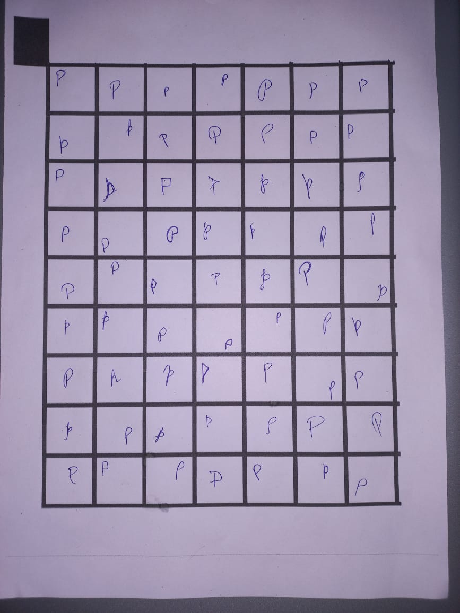
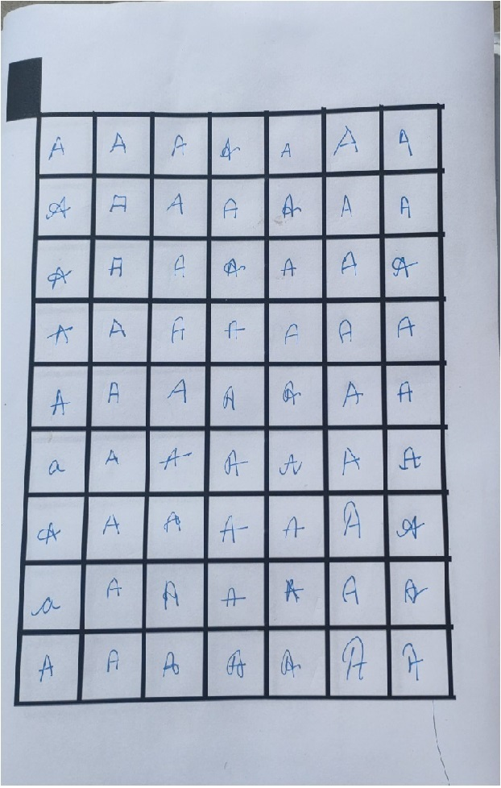
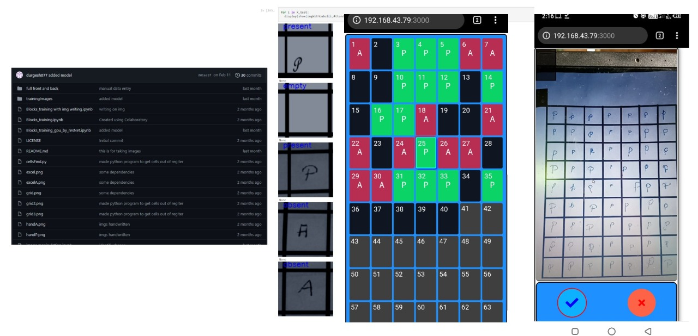
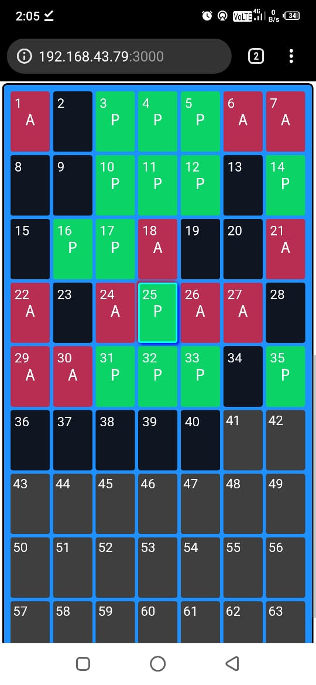
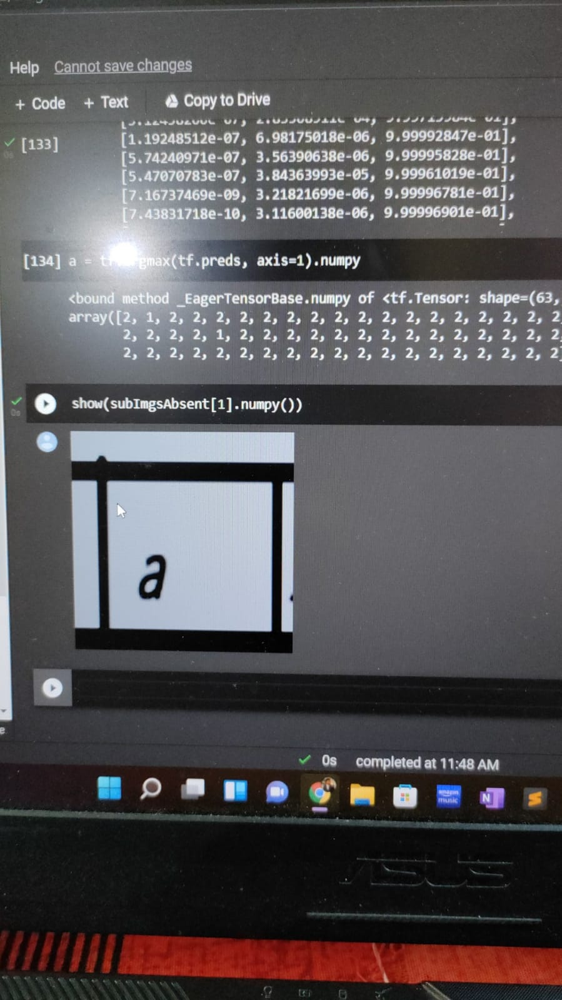

<h1>This is a intelligent automatic record manager </h1>
<h2>About:</h2>
<ul>
  <li>An application to lever the burden on teacher who spend a lots of time updating records</li>
  <li>It uses MERN Stack</li>
  <li> ML based OCR technology</li>
 </ul>

<h2>Features:</h2>
<pre>
This is a machine learning project which also involves full stack web development .
I've used many frameworks to facilitate the feature I was looking for.
I've made my own combination of resnet and conv net to get optimized size and best prediction.
used opencv for extracting cell of square grid. 
Also gave interface to modify manually .
this web application is written in reactJs for frontend, nodeJs or backend and python for machine learning . 
</pre>

<h1>Some images</h1>
<figures>
  <caption>
    Some training images
  </caption>
 | 
   | 
  
  </figures
 

https://user-images.githubusercontent.com/66236446/173692150-abc6a4d3-3997-45de-8a15-808b29e25040.mp4

